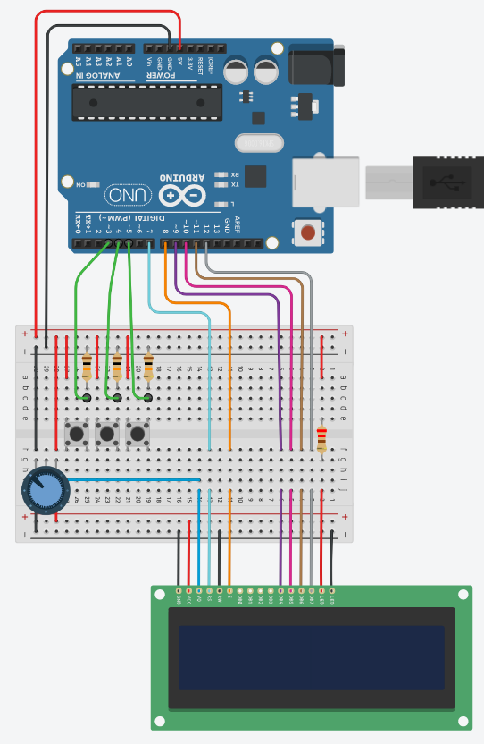

# aoRPS

---

## **Abstract**

This project aims at emulate the game Rock, Paper, Scissors with an Arduino.

## **Usage**

Once the Arduino is powered on, it will wait for your move.  
The push buttons on the breadboard represents the choices you can make:

- Rock (left button)
- Paper (middle button)
- Scissors (right button)

After you made your move, the computer will select his.  
Then, the winner is decided, as specified with the rules:

- Rock beats Scissors
- Paper beats Rock
- Sissors beat Paper

Whoever wins the game gets one point. Scores will be display at the end of the turn and before the beginning of a new one.

## **List of Materials**

| Quantity | Description |
| --- | --- |
| 1 | Arduino Uno (Rev3) |
| 1 | LCD 16x2 |
| 1 | Resistor 220 Ohms |
| 3 | Resistor 10 KOhms |
| 3 | Pushbutton |
| 1 | Potentiometer 250 KOhms |

## **Schematics**

