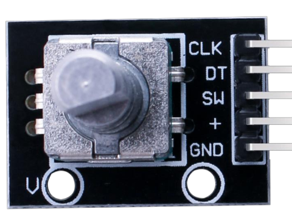
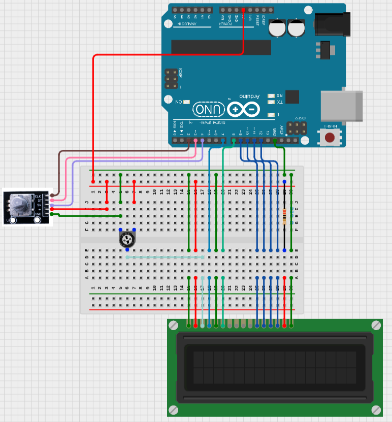
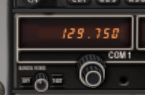

# aoXPlane

---

## **Abstract**

This little project aims at connecting an Arduino to the flight simulator X-Plane and 
modify the COM1 frquency value.

## **Arduino**

A rotary encoder module is used to modify both the integer and decimal part of the COM1 Frequency. To be able to do so with only one encoder, the switch act as a trigger to select which number to change.

A LCD will display the current frequency value and will be in sync with the simulator.

### **Schematics**

### **List of Materials**

| Quantity | Description |
| --- | --- |
| 1 | Arduino Uno (Rev3) |
| 1 | LCD 16x2 |
| 1 | Resistor 220 Ohms |
| 1 | Potentiometer 250 KOhms |
| 1 | Rotary Encoder Module |

## **X-Plane**

The communication with X-Plane is done through DATAREF.  
The one we will playing with is "**sim/cockpit/radios/com1_freq_hz**".  
It's directly linked to the COM1 avionics panel.

To access the DATAREF, we can directly send our commands to the UDP port 49000.

## **Python**

The script will act as a glue between the Arduino serial port and X-Plane UDP port.  
When the encoder is turned, the Arduino modify its internal representation of the COM1 value and push it on the serial link.  

Python reads this value and sends it to X-Plane to update the COM1 frequency in the simulator.

The communication is only unilateral. From the Arduino to the Simulator.  
If you modify the value in the simulator, it won't be reflected on the Arduino.

## **Usage**

1. Start the simulator up to the avionics
2. Start the arduino
3. Start the python script

At this point both the Simulator and the Arduino will reflect the same value.
