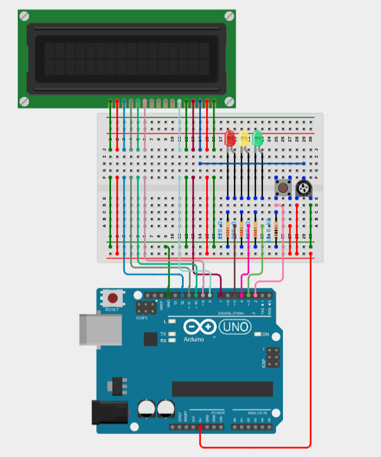

# aoMagic8

---

## **Abstract**

This project aims at reproduce the behaviour of the famous Magic-8 ball with an Arduino.  

## **Usage**

Power on the Arduino. It will welcome you with the message
> Make a wish and  
> push the button

Once your wish is speak out loud, push the button and wait.  
The Arduino will flash the LEDs while it thinks.  
Once the thinking period is over, it will display its answer on the screen.

## **List of Materials**

| Quantity | Description |
| --- | --- |
| 1 | Arduino Uno (Rev3) |
| 1 | LCD 16x2 |
| 3 | LED (Red/Yellow/Green) |
| 4 | Resistor 220 Ohms |
| 1 | Resistor 1 KOhms |
| 1 | Pushbutton |
| 1 | Potentiometer |

## **Schematics**

